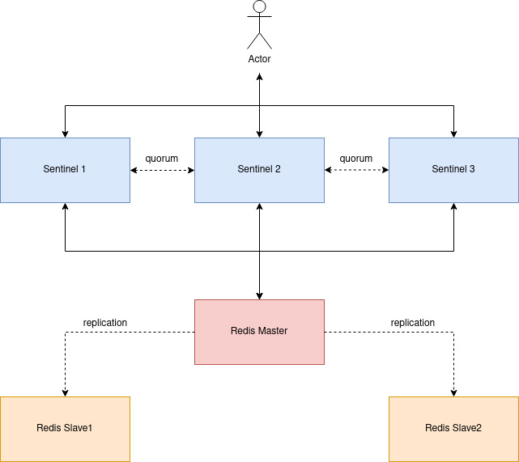

# Тестовый стенд высокодоступного Redis



По адресу http://localhost:8088/ доступен веб-интерфейс [redis-commander](https://github.com/joeferner/redis-commander), куда подключены все серверы `redis` (пароль `str0ng_passw0rd`) и `sentinel` (без пароля) (но `sentinel` виден только один).

Писать можно только в `master сервер redis`, читать можно с любого сервера `redis`.

`Sentinel` позволяет писать в любой сервер, но все запросы будут направлены на `master сервер redis`.

Запустить кластер:
```bash
$ docker compose up
```


## Сервер Redis

Подключение к серверу `redis`:
```bash
$ docker exec -it redis-master /bin/bash
$ redis-cli -p 6379
$ auth str0ng_passw0rd
```

[Переключение на другой протокол](https://redis.io/commands/hello/) (в зависимости от протокола меняется формат ответа):
```bash
$ hello 3
```

Детальная [информация по серверу](https://redis.io/commands/info/):
```bash
$ info
```

[Добавить новую ноду реплики](https://redis.io/commands/replicaof/) (на самой ноде будущей реплики):
```bash
$ REPLICAOF master-host master-port
```

Состояние репликации:
```bash
$ info replication
```


## Сервер Sentinel

[Документация](https://redis.io/docs/management/sentinel/).

Войти в `Sentinel`:
```bash
$ docker compose exec redis-sentinel1 bash
$ redis-cli -p 26379
```

Параметры текущего `redis master`:
```bash
$ sentinel get-master-addr-by-name mymaster
```

Информация о мастере `mymaster`:
```bash
$ sentinel master mymaster
```

Инфомрация о репликах мастера `mymaster`:
```bash
$ sentinel replicas mymaster
```


## Перевыбор мастера

Можно отключить ноду `redis master`:
```bash
$ docker compose stop redis-master
```

Запустить переизбрание `redis master сервера` кворумом `sentinel` (команда для любого `sentinel-server`):
```bash
$ sentinel failover mymaster
```
